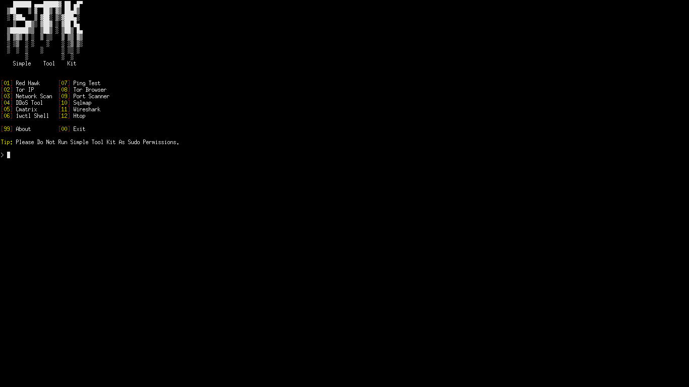

# 🛡️ Simple Tool Kit Desktopless – Yeni Başlayanlar İçin Bir Siber Güvenlik Aracı

**Simple Tool Kit Desktopless**, etik hackleme ve ağ güvenliği alanında ilk adımlarını atanlar için tasarlanmış, hafif,kullanıcı dostu ve adından da anlaşıldığı üzere masaüstü olmayan sistemler için üretilmiş bir siber güvenlik araç setidir. Karmaşık profesyonel araçların aksine, bu proje sadelik, açıklık ve uygulamalı öğrenmeye odaklanarak temel araçları tek bir kolay pakette bir araya getirir.

## 👥 Hedef Kitle

Bu araç seti şu kişiler için idealdir:

- Siber güvenliğe yeni başlayan öğrenciler ve meraklılar  
- Temel Linux/terminal bilgisine sahip olup güvenlik araçlarını keşfetmek isteyenler  
- Çevrimdışı ve güvenli bir şekilde siber güvenlik pratiği yapmak isteyen kendi kendine öğrenenler  
- Etik hack temellerini öğreten eğitmenler veya mentorlar

## 🧰 İçindekiler

Bu araç seti temel ama önemli birkaç siber güvenlik aracını içerir:

- IP ve domain port tarayıcı  
- DDoS aracı  
- DNS ve HTTP başlık analizi ile WHOIS tarayıcı (Üçü Bir Arada)  
- Tor IP aracı vb.  
- SQL enjeksiyonu (Sqlmap)

> Araçlar **Python (≈%85)** ve **Shell (≈%14)** kullanılarak geliştirilmiştir; bu sayede taşınabilirlik ve betik uyumluluğu sağlanmıştır.

## 🔍 Neden Bu Proje?

Siber güvenliğe başlamak çoğu zaman göz korkutucu olabilir. Çoğu güçlü araç karmaşık yapıdadır veya ön bilgi gerektirir. **Simple Tool Kit**, öğrenme ile uygulama arasındaki farkı kapatarak, Metasploit, Burp Suite veya Wireshark gibi büyük araçlara geçmeden önce güvenli bir şekilde deneyim kazanmanı sağlar.

## 🛠️ Nasıl Kullanılır

1. Depoyu klonla:
   ```bash
   git clone https://github.com/ctrl-alt-del-2010-developer/simple-tool-kit.git
   cd simple-tool-kit
   cd STK
   ```

2. Bağımlılıkları yükle:
   ```bash
   sudo bash setup.sh
   ```

3. Aracı çalıştır (Lütfen root yetkileriyle **çalıştırma**):
   ```bash
   bash run.sh
   ```
## Ve Sonuç!
   

4. Açılan menüden bir araç seç — her biri açıklamalarıyla birlikte gelir ve yeni başlayanlar için uygundur.

## 📁 Proje Yapısı

```
simple-tool-kit/
├── LICENSE
├── STK/
|   ├── ascii.txt
|   ├── README.md
|   ├── requirements.txt
|   ├── setup.sh
|   ├── run.sh
|   └── Programs 
│        ├── port_scanner.py
│        ├── DDoS-tool.py
│        ├── about.txt
|        ├── ip_changer.py
│        └── red_hawk.py
```

## 🚀 Gelecek Planları

* Daha fazla araç eklemek (örneğin: zafiyet tarayıcıları, parola kırıcılar)  
* Tkinter veya PyQt kullanarak GUI (grafik arayüz) sürümü oluşturmak  
* Çok dilli destek eklemek (İngilizce / Türkçe)  
* Kayıt tutma (logging) ve raporlama özellikleri eklemek  
* Eğitim platformlarıyla entegrasyon sağlamak

## 💻 Eğitimsel Değer

Bu araçları kullanarak **nasıl çalıştıklarını öğrenebilirsin**. Kod basit, iyi yorumlanmış ve öğreticidir.

* Siber güvenlik için Python betik yazımını öğren  
* Komut satırı üzerinden ağ etkileşimini kavra  
* Bash ve Python’u etkili bir şekilde birleştir

## 🧠 Felsefe

> İnşa ederek öğren. Kullanarak öğren.

Bu araç seti bir **başlangıç noktasıdır** — daha büyük ve gelişmiş araçlara geçmeden önce bir sıçrama tahtası. Keşfetmek, öğrenmek ve etik bir şekilde kullanmak için tasarlanmıştır.

## 📜 Lisans

**MIT Lisansı** altında lisanslanmıştır.  
Kişisel ve eğitim amaçlı kullanım, değiştirme veya dağıtım serbesttir.

## 🤝 Katkıda Bulunma

Kodlamaya yeni misin? Harika!

* Yazım hatalarını düzelt veya bu README’yi geliştir  
* Yeni araçlar ekle  
* Hataları bildir veya yeni özellikler iste (Issues / Pull Requests)

Tüm katkılar değerlidir — hiçbir çaba küçük değildir.

---

🧑‍💻 **Simple Tool Kit**, eğitim amacıyla geliştirilmiştir.  
Siber güvenliğe adım atmaya hazırsan, başlamak için doğru yerdesin.

🔗 GitHub: [https://github.com/ctrl-alt-del-2010-developer/simple-tool-kit](https://github.com/ctrl-alt-del-2010-developer/simple-tool-kit)
